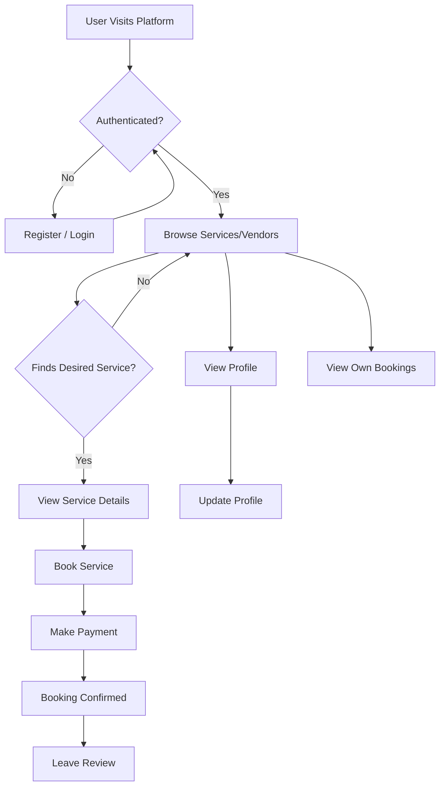
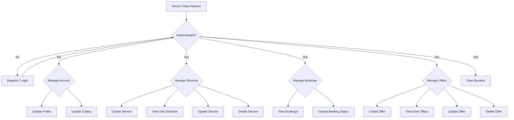

# Event Manager Backend Documentation

This document provides an overview of the Event Manager backend application, detailing its core functionalities, and the specific flows for Users, Admins, and Vendors.

## Table of Contents
1.  [Overview](#overview)
2.  [Authentication](#authentication)
3.  [User Flow](#user-flow)
4.  [Vendor Flow](#vendor-flow)
5.  [Admin Flow](#admin-flow)
6.  [API Endpoints Summary](#api-endpoints-summary)

## 1. Overview

The Event Manager backend is a Node.js application built with Express.js. It facilitates event management by connecting users seeking services with vendors offering them. The system supports distinct roles with specific permissions and functionalities. Key features include user registration and login, service browsing, booking, payments, reviews, and administrative management.

## 2. Authentication

Authentication is handled via JWT (JSON Web Tokens).

*   **Registration**: New users ([`POST /api/auth/register`](routes/auth.Routes.js:22)) and vendors can register. Vendor registration may require admin approval.
    *   **Required Information for User Registration**:
        *   `name` (String, required)
        *   `email` (String, required, unique, valid email format)
        *    `number` (Number required)
        *   `password` (String, required, min 8 characters)
        *   `role` (String, enum: 'user', 'vendor', 'admin', defaults to 'user')
    *   **Additional Required Information for Vendor Registration**:
        *   `category` (String, required if role is 'vendor') - This likely refers to the main category the vendor operates in.
        *   `profilePhoto` (String, optional, defaults to 'default.jpg')
        *   `description` (String, optional, max 500 chars)
*   **Login**: Registered users ([`POST /api/auth/login`](routes/auth.Routes.js:23)) can log in to receive a JWT.
*   **Logout**: Users can log out ([`GET /api/auth/logout`](routes/auth.Routes.js:26)).
*   **Password Management**:
    *   Forgot Password ([`POST /api/auth/forgot-password`](routes/auth.Routes.js:42)): Allows users to request a password reset.
    *   Reset Password ([`PUT /api/auth/reset-password`](routes/auth.Routes.js:43)): Allows users to set a new password using a reset token.
*   **Profile Management**:
    *   Get My Profile ([`GET /api/auth/me`](routes/auth.Routes.js:27)): Authenticated users can retrieve their profile information.
    *   Update Profile ([`PUT /api/auth/update-profile`](routes/auth.Routes.js:28)): Authenticated users can update their profile details.

## 3. User Flow

Users are consumers looking for event-related services.

**Core User Functionalities:**

*   **Account Management**:
    *   Register as a user.
    *   Login and Logout.
    *   Manage their profile (view and update).
    *   Reset forgotten password.
*   **Service Discovery**:
    *   View services by category ([`GET /api/services/category/:category`](routes/service.Routes.js:30)).
    *   Search for services ([`GET /api/services/search`](routes/service.Routes.js:31)).
    *   View details of a specific vendor ([`GET /api/vendors/:id`](routes/vendor.Routes.js:14)).
    *   View services offered by a specific vendor ([`GET /api/services/vendor/:vendorId`](routes/service.Routes.js:21)).
*   **Booking Management**:
    *   Create a booking for a service ([`POST /api/bookings`](routes/booking.Routes.js:11)).
    *   View their own bookings ([`GET /api/bookings/user/:id`](routes/booking.Routes.js:13)).
*   **Payments**:
    *   Create a Razorpay order for payment ([`POST /api/payments/create-order`](routes/payment.Routes.js:9)).
    *   Verify payment status ([`POST /api/payments/verify`](routes/payment.Routes.js:10)).
*   **Reviews**:
    *   Add a review for a service ([`POST /api/reviews`](routes/review.Routes.js:14)).
    *   Update their own review ([`PUT /api/reviews/:id`](routes/review.Routes.js:15)).
    *   Delete their own review ([`DELETE /api/reviews/:id`](routes/review.Routes.js:16)).
    *   View reviews for a specific service ([`GET /api/reviews/service/:serviceId`](routes/review.Routes.js:12)).
    *   View reviews for a specific vendor ([`GET /api/reviews/vendor/:vendorId`](routes/review.Routes.js:13)).
*   **Offers**:
    *   View available offers (implicitly through services, or if a general offer viewing endpoint exists for users - currently admin/vendor focused in [`routes/offer.Routes.js`](routes/offer.Routes.js)).
    *   View categories ([`GET /api/admin/categories`](routes/admin.Routes.js:19)) - *Note: This route is under admin but seems public, might be intended for general use.*

**User Flow Diagram (Conceptual):**



## 4. Vendor Flow

Vendors are service providers offering their services on the platform.

**Core Vendor Functionalities:**

*   **Account Management**:
    *   Register as a vendor (may require admin approval). See [Authentication](#authentication) for required fields.
    *   Login and Logout.
    *   Manage their profile (view and update via [`PUT /api/auth/update-profile`](routes/auth.Routes.js:28)).
    *   Update their image gallery ([`PUT /api/auth/update-gallery`](routes/auth.Routes.js:31) or [`POST /api/vendors/:id/gallery`](routes/vendor.Routes.js:16)).
    *   Reset forgotten password.
*   **Service Management**:
    *   Create new services ([`POST /api/services`](routes/service.Routes.js:14)).
        *   **Required Information to Add a Service**:
            *   `vendor` (ObjectID, ref: 'User', required - automatically linked to the logged-in vendor)
            *   `title` (String, required, max 100 chars)
            *   `description` (String, required, max 5000 chars)
            *   `minPrice` (Number, required, non-negative)
            *   `maxPrice` (Number, required, >= minPrice)
            *   `category` (ObjectID, ref: 'Category', required)
            *   `subCategory` (String, required, must exist in the chosen category's subCategories)
            *   `images` (Array of Strings, optional, max 10 images)
            *   `location` (String, required)
            *   `phone` (String, required)
            *   `website` (String, optional)
            *   `socialLinks` (Object with facebook, instagram, twitter, youtube strings, optional)
            *   `tags` (Array of Strings, optional)
    *   View their own services ([`GET /api/services/vendor/:vendorId`](routes/service.Routes.js:21)).
    *   Update existing services ([`PUT /api/services/:id`](routes/service.Routes.js:22)).
    *   Delete services ([`DELETE /api/services/:id`](routes/service.Routes.js:29)).
*   **Booking Management**:
    *   View bookings made for their services ([`GET /api/bookings/vendor/:id`](routes/booking.Routes.js:12)).
    *   Update booking status (e.g., confirm, cancel) ([`PUT /api/bookings/:id/status`](routes/booking.Routes.js:14)).
*   **Offer Management**:
    *   Create offers for their services ([`POST /api/offers`](routes/offer.Routes.js:12)).
        *   **Required Information to Add an Offer**:
            *   `vendor` (ObjectID, ref: 'User', required - automatically linked)
            *   `service` (ObjectID, ref: 'Service', required - the service this offer applies to)
            *   `title` (String, required, max 100 chars)
            *   `description` (String, required, max 500 chars)
            *   `bannerImage` (String, required - URL or path to the image)
            *   `originalPrice` (Number, required, non-negative)
            *   `discountedPrice` (Number, required, non-negative, less than originalPrice)
            *   `validFrom` (Date, required, defaults to now)
            *   `validTill` (Date, required, must be after validFrom)
            *   `isActive` (Boolean, optional, defaults to true)
    *   View their own offers ([`GET /api/offers/my-offers`](routes/offer.Routes.js:15)).
    *   Update their offers ([`PUT /api/offers/:id`](routes/offer.Routes.js:17)).
    *   Delete their offers ([`DELETE /api/offers/:id`](routes/offer.Routes.js:17)).
    *   Toggle offer status (active/inactive) ([`PUT /api/offers/:id/toggle-status`](routes/offer.Routes.js:21)).
*   **Reviews**:
    *   View reviews for their services ([`GET /api/reviews/service/:serviceId`](routes/review.Routes.js:12)).
    *   View reviews for themselves as a vendor ([`GET /api/reviews/vendor/:vendorId`](routes/review.Routes.js:13)).

**Vendor Flow Diagram (Conceptual):**



## 5. Admin Flow

Admins have oversight and management capabilities over the entire platform.

**Core Admin Functionalities:**

*   **User Management**:
    *   View all users ([`GET /api/auth/users`](routes/auth.Routes.js:34)).
    *   View a specific user's details ([`GET /api/auth/users/:id`](routes/auth.Routes.js:35)).
    *   Update user details ([`PUT /api/auth/users/:id`](routes/auth.Routes.js:36)).
    *   Delete users ([`DELETE /api/auth/users/:id`](routes/auth.Routes.js:37)).
*   **Vendor Management**:
    *   View all vendors ([`GET /api/admin/vendors`](routes/admin.Routes.js:14)).
    *   Approve/Reject vendor registrations ([`PUT /api/auth/users/:id/approval`](routes/auth.Routes.js:38) or [`PUT /api/admin/vendors/:id/approve`](routes/admin.Routes.js:15)).
    *   (Implicitly) Manage vendor details through general user management if vendors are a type of user.
    *   (Implicitly) Manage vendor services and bookings if needed, though direct routes are vendor-authorized.
*   **Category Management**:
    *   Create new service categories ([`POST /api/admin/categories`](routes/admin.Routes.js:18)).
        *   **Required Information to Add a Category**:
            *   `title` (String, required, unique, max 50 chars)
            *   `image` (String, required - URL or path to the category image)
            *   `subCategories` (Array of Strings, optional - for defining sub-categories within this main category)
    *   View all categories ([`GET /api/admin/categories`](routes/admin.Routes.js:19)).
*   **Offer Management (Platform-wide)**:
    *   View all offers on the platform ([`GET /api/admin/offers`](routes/admin.Routes.js:22)).
    *   View details of a specific offer ([`GET /api/admin/offers/:id`](routes/admin.Routes.js:23)).
*   **Booking Management (Oversee)**:
    *   Admins can view vendor bookings ([`GET /api/bookings/vendor/:id`](routes/booking.Routes.js:12)).
    *   Admins can view user bookings ([`GET /api/bookings/user/:id`](routes/booking.Routes.js:13)).
    *   Admins can update booking status ([`PUT /api/bookings/:id/status`](routes/booking.Routes.js:14)).
*   **Review Management**:
    *   Admins can add reviews (e.g., on behalf of a user or for testing) ([`POST /api/reviews`](routes/review.Routes.js:14)).
    *   Admins can update any review ([`PUT /api/reviews/:id`](routes/review.Routes.js:15)).
    *   Admins can delete any review ([`DELETE /api/reviews/:id`](routes/review.Routes.js:16)).

**Admin Flow Diagram (Conceptual):**

```mermaid
graph TD
    %% Main Flow
    AdminLogin[Admin Logs In] --> AdminDashboard{Admin Dashboard}

    %% User Management Module
    subgraph sg_Users [User Management]
        Users_Manage[Manage Users]
        Users_View[View Users]
        Users_Update[Update User]
        Users_Delete[Delete User]

        Users_Manage --> Users_View
        Users_Manage --> Users_Update
        Users_Manage --> Users_Delete
    end
    AdminDashboard --> Users_Manage

    %% Vendor Management Module
    subgraph sg_Vendors [Vendor Management]
        Vendors_Manage[Manage Vendors]
        Vendors_View[View Vendors]
        Vendors_ApproveReject[Approve/Reject Vendor]

        Vendors_Manage --> Vendors_View
        Vendors_Manage --> Vendors_ApproveReject
    end
    AdminDashboard --> Vendors_Manage

    %% Category Management Module
    subgraph sg_Categories [Category Management]
        Categories_Manage[Manage Categories]
        Categories_Create[Create Category]
        Categories_View[View Categories]

        Categories_Manage --> Categories_Create
        Categories_Manage --> Categories_View
    end
    AdminDashboard --> Categories_Manage

    %% Offer Management Module
    subgraph sg_Offers [Offer Management (Platform)]
        Offers_ManagePlatform[Manage Offers (Platform)]
        Offers_ViewAll[View All Offers]

        Offers_ManagePlatform --> Offers_ViewAll
    end
    AdminDashboard --> Offers_ManagePlatform

    %% Booking Oversight Module
    subgraph sg_Bookings [Booking Oversight]
        Bookings_Oversee[Oversee Bookings]
        Bookings_ViewUserVendor[View User/Vendor Bookings]
        Bookings_UpdateStatus[Update Booking Status]

        Bookings_Oversee --> Bookings_ViewUserVendor
        Bookings_Oversee --> Bookings_UpdateStatus
    end
    AdminDashboard --> Bookings_Oversee

    %% Review Management Module
    subgraph sg_Reviews [Review Management]
        Reviews_Manage[Manage Reviews]
        Reviews_ModerateDelete[Moderate/Delete Reviews]

        Reviews_Manage --> Reviews_ModerateDelete
    end
    AdminDashboard --> Reviews_Manage

    %% Styling (Optional: Enhances visual clarity and professionalism)
    classDef module fill:#ececff,stroke:#9090ff,stroke-width:2px,color:#000033,font-weight:bold;
    classDef action fill:#f9f9f9,stroke:#cccccc,stroke-width:1px,color:#333333;
    classDef dashboard fill:#fff0e6,stroke:#ffb366,stroke-width:2px,color:#994d00,font-weight:bold;
    classDef login fill:#e6ffe6,stroke:#80ff80,stroke-width:2px,color:#006600;

    class AdminLogin login;
    class AdminDashboard dashboard;
    class Users_Manage,Vendors_Manage,Categories_Manage,Offers_ManagePlatform,Bookings_Oversee,Reviews_Manage module;
    class Users_View,Users_Update,Users_Delete,Vendors_View,Vendors_ApproveReject,Categories_Create,Categories_View,Offers_ViewAll,Bookings_ViewUserVendor,Bookings_UpdateStatus,Reviews_ModerateDelete action;
```

## 6. API Endpoints Summary

This section provides a high-level list of the main route groups. Refer to the respective route files for detailed endpoints.

*   **Auth Routes** ([`routes/auth.Routes.js`](routes/auth.Routes.js)): Handles registration, login, logout, profile management, password reset, and admin user management.
*   **Admin Routes** ([`routes/admin.Routes.js`](routes/admin.Routes.js)): Handles vendor approval, category management, and viewing platform-wide offers.
*   **Vendor Routes** ([`routes/vendor.Routes.js`](routes/vendor.Routes.js)): Handles public vendor information and vendor-specific gallery updates.
*   **Service Routes** ([`routes/service.Routes.js`](routes/service.Routes.js)): Handles service creation, updates, deletion, and various ways to retrieve/search services.
*   **Booking Routes** ([`routes/booking.Routes.js`](routes/booking.Routes.js)): Handles booking creation, viewing (user/vendor specific), and status updates.
*   **Review Routes** ([`routes/review.Routes.js`](routes/review.Routes.js)): Handles adding, updating, deleting, and retrieving reviews for services and vendors.
*   **Payment Routes** ([`routes/payment.Routes.js`](routes/payment.Routes.js)): Handles payment order creation and verification (e.g., with Razorpay).
*   **Offer Routes** ([`routes/offer.Routes.js`](routes/offer.Routes.js)): Handles vendor-specific offer creation, management, and status toggling.

---
*This document provides a general overview. For precise details on request/response formats, specific middleware, and controller logic, please refer to the source code.*